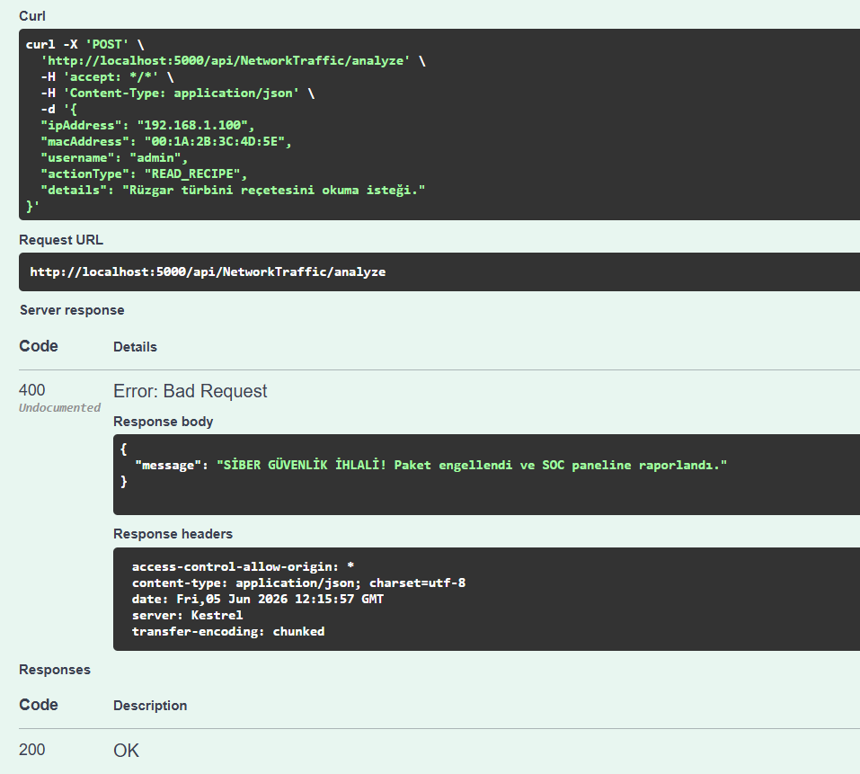
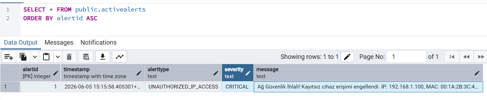
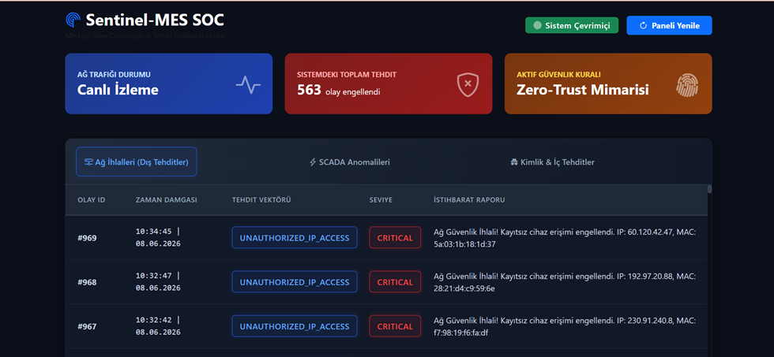
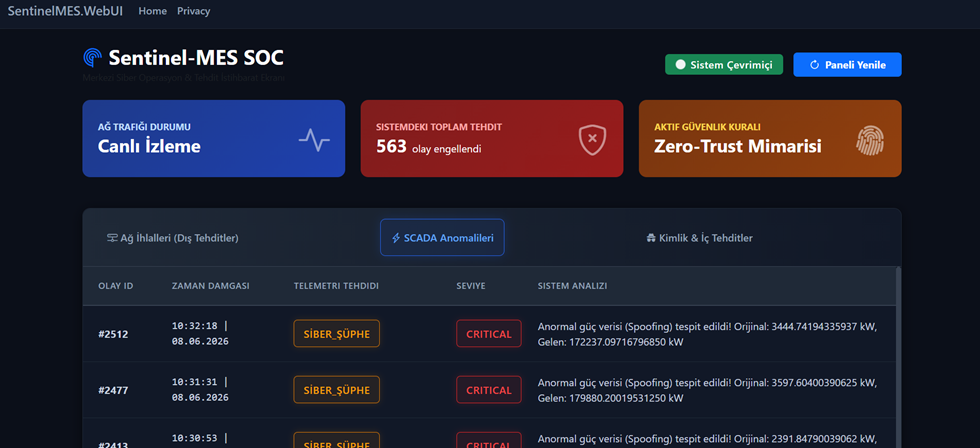
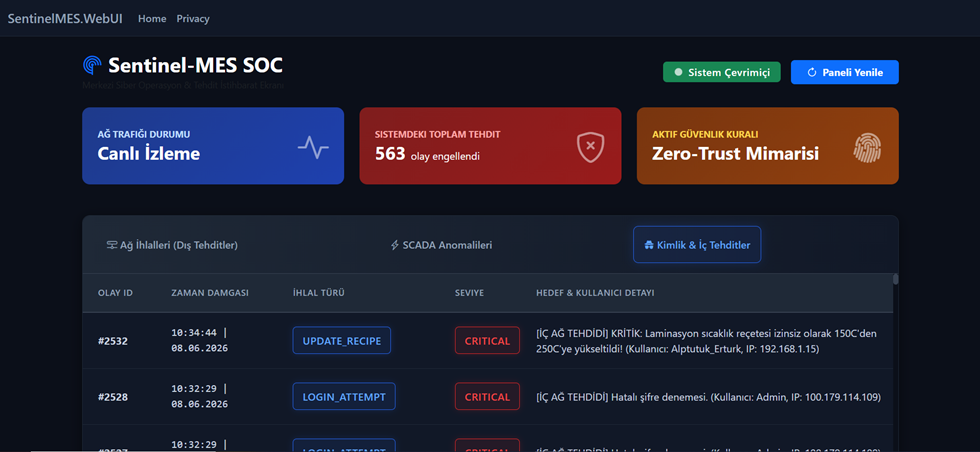

# Sentinel-MES: Endüstriyel Veri ve Anomali İzleme Merkezi

Sentinel-MES, Temiz Mimari (Clean Architecture) ile tasarlanmış, Kaggle verileriyle desteklenen, internete kapalı (Air-gapped) OT sistemleri için yapay zekâ destekli siber güvenlik ve operasyonel izleme platformudur. Savunma sanayisi ve kritik altyapı tesislerinin (Örn: Enerji santralleri, Akıllı Fabrikalar) siber ve fiziksel güvenliğini sağlamak amacıyla **OT-SIEM/SOAR** konseptinde geliştirilmiştir.

---

## Proje Fazları ve Yol Haritası

### Faz 1: Hibrit Simülasyon Motoru (Data Streaming & Threat Injection)
Sıfırdan rastgele veri üretmek yerine, gerçek dünya verisi kullanılarak oluşturulan ve üzerine siber zafiyetlerin eklendiği canlı veri akış katmanıdır.
* **Fiziksel Akış (Kaggle SCADA Verisi):** Gerçek bir rüzgar türbinine ait geçmiş veriler (sıcaklık, rüzgar hızı, güç) `CsvHelper` ile satır satır okunur. Zaman damgası "şu anki zamana" güncellenerek saniyede bir PostgreSQL veritabanına (`MachineTelemetry` tablosu) yazılır. Sistem gerçek bir PLC gibi davranır.
* **Siber Tehdit Enjeksiyonu (Bogus Kütüphanesi):** Fiziksel veri akarken, arka planda çalışan C# Worker Service bir "Olasılık Zarı" atar. Çıkan sonuca göre `SystemAuditLogs` tablosuna sahte siber loglar basılır.
  * **Senaryolar:**
    * **%84 Normal Operasyon:** Sadece fiziksel veri akar.
    * **%10 Rutin Giriş:** Vardiya başı operatör giriş logları.
    * **%4 Kaba Kuvvet Saldırısı:** Dış IP'lerden peş peşe hatalı "Admin" şifre denemeleri.
    * **%2 İç Tehdit / Sabotaj:** Gece saatlerinde yetkisiz bir IP'den gelen "Reçete Güncelleme" (`UPDATE_RECIPE`) komutları.

### Faz 2: SQL ve Veritabanı Katmanı (Merkezi Zeka ve OT SOC Kuralları)
Sistemin bel kemiği olan PostgreSQL, sadece depo değil, aynı zamanda ilk savunma hattıdır.
* **Dinamik Eşik Tabloları (`SystemThresholds`):** Makine sensörlerinin alt/üst sınırları SQL tablosunda tutulur. Başka bir fabrikaya kurulurken sadece bu tablo güncellenir.
* **Ağırlaştırılmış Log Tabloları (`SystemAuditLogs`):** OT SOC mantığına uygun olarak; MAC adresi, IP adresi, hedef tablo (örneğin reçeteler veya iş emirleri) ve işlem tipinin kaydedildiği yapı.
* **SQL Trigger'ları:** Aşırı kritik bir durum olduğunda (örn: Reçete değişimi) .NET'i beklemeden doğrudan veritabanı seviyesinde alarm flag'leri üretilir.

### Faz 3: .NET 9 Backend ve Temiz Mimari (OT SOC Kural Motoru)
Sistemin beyni olan API, MES'teki teorik riskleri gerçek zamanlı olarak izler ve yakalar.
* **Veri Toplama (Data Acquisition) Koruması:** Saniyede 10 satır veri atan bir makineden saniyede 1000 satır veri gelirse DDoS / Sorgu Taşkını alarmı üretilir.
* **Ağ ve Donanım (Network/Hardware) Koruması:** Sistemde daha önce hiç görülmemiş bir IP veya MAC adresi ağda veri çekmeye çalışırsa Gölge IT (Shadow IT) alarmı üretilir. Makine IP'leri birbiriyle konuşmaya çalışırsa Yatay Hareket (Lateral Movement) tespiti yapılır.
* **Üretim Teorisi (MES Production) Koruması:** Reçete (`Recipe`) değişiklikleri, iş emri (`Work Order`) silinmesi veya bir operatörün admin ekranına girmesi İç Tehdit ve Ayrıcalık Yükseltme olarak algılanıp engellenir.

### Faz 4: Açıklanabilir Yapay Zekâ (XAI Entegrasyonu)
Klasik statik kuralların (Faz 3) göremediği, sistemdeki gizli dengesizlikleri bulan yapay zekâ modülüdür.
* **Stacking Ensemble Modeli:** Kaggle'dan gelen fiziksel SCADA verileri ile Bogus'tan gelen siber loglar harmanlanarak modele öğretilir. Model, "Bu makine çalışmıyorken neden buradan SQL'e veri geliyor?" gibi mantıksal bozuklukları (Fiziksel İmkansızlık/Spoofing) öğrenir.
* **SHAP (Açıklanabilir AI):** Dashboard'da "Anomali var" demek yerine; *"Uyarı: %92 Anomali. Sebep: Makine hızı normal, ancak bağlı olduğu PLC'nin MES sunucusuna attığı SQL sorgu frekansı son 1 saatte 10 kat arttı (Potansiyel Zararlı Yazılım)"* şeklinde net açıklamalar üretir.

### Faz 5: Dashboard ve Kriz İletişimi (Kullanıcı Arayüzü)
Tüm verilerin izlendiği ve internete kapalı ağlarda bile bildirim gönderebilen SOC kontrol merkezidir.
* **OT SOC Paneli:** Ekranın solunda canlı makine değerleri (Rüzgar/Sıcaklık), sağında ise gerçek zamanlı siber tehdit uyarıları (Kırmızı alarmlar, engellenen IP'ler) ve Küresel Tehdit Radarı (Geo-IP) yer alır.
* **Offline Bildirim Sistemi:** Şirket internete kapalı (Air-gapped) olduğu için e-posta kullanılamadığından, sunucuya bağlı Fiziksel GSM Modem üzerinden çalışan .NET servisi ile kritik olaylarda yöneticilere doğrudan SMS atılması hedeflenmiştir.

---

### Siber Güvenlik Kural Motoru (Security Rule Engine) Testi

Sistem, ağ trafiğini anlık olarak dinler ve kural motoru sayesinde anında aksiyon alır. 
Aşağıdaki test senaryosunda, yetkisiz bir IP'nin rüzgar türbini reçetesini okuma isteğinin API tarafından nasıl bloklandığı ve veritabanına loglandığı görülmektedir:

**1. REST API (Swagger) Üzerinden 400 Bad Request Engellemesi:**

**2. Olayın Anında OT SOC Veritabanına (PostgreSQL) Loglanması:**

---

##  Uçtan Uca Sistem Mimarisi (Clean Architecture)

Proje, geleneksel monolitik bir yapı yerine bağımlılıkları en aza indiren (Decoupled) **6 Ana Katman** üzerinden çalışmaktadır:

1. **`SentinelMES.Domain` (Çekirdek):** Mimarinin en iç katmanıdır. `ActiveAlert` ve `SystemAuditLog` gibi sistemin ana varlıklarını (Entities) tutar. Hiçbir dış teknolojiye bağımlı değildir.
2. **`SentinelMES.Application` (İş Kuralları):** Sistemde "nelerin yapılacağını" (Örn: `IAlertRepository`) tanımlar. Arayüzleri ve iş sözleşmelerini barındırır.
3. **`SentinelMES.Infrastructure` (Altyapı):** Veritabanı ve dış dünya ile asıl iletişimin kurulduğu yerdir. PostgreSQL bağlantıları, Entity Framework Core Migrations ve Repositories burada bulunur.
4. **`SentinelMES.Simulator` (Dijital İkiz):** Kaggle verilerini ve Bogus siber saldırılarını arka planda sisteme enjekte eden "Worker Service" test motorudur.
5. **`SentinelMES.WebAPI` (Güvenlik Duvarı):** Dış dünyaya açılan yegane kapıdır. Tüm veriler bu RESTful API'nin kural motorundan (Detect) geçerek filtrelenir.
6. **`SentinelMES.WebUI` (SOC Komuta Kontrol):** Güvenlik analistleri için karanlık tema (Dark Mode), olay müdahale butonları (Incident Response) ve XAI Wireshark paketi analiz arayüzleri sunan MVC tabanlı izleme panelidir.

> **Mimari Vizyon (Neden Mikroservise Hazır?):**
> Sistem bilerek API (Backend) ve UI (Frontend) olarak ayrılmıştır. Bu sayede ileride tesis yöneticileri için bir Mobil Uygulama geliştirilmek istendiğinde arka plan kodlarına dokunulmadan sadece yeni bir arayüz yazılarak mevcut API'ye bağlanılabilir. Ayrıca veritabanı ile kullanıcı arayüzü sunucularının farklı ağlarda tutulması siber saldırılara karşı maksimum izolasyon (Air-gap) sağlamaktadır.

---

##  Sistem Mimari Diyagramı

---

## Sentinel-MES SOC Arayüzü (Canlı Ekran Görüntüleri)

Sistem, güvenlik analistleri için 3 farklı tehdit vektörünü ayrı komuta sekmelerinde izleme imkanı sunar:

**1. Dış Tehditler ve Ağ İhlalleri (Unauthorized Access):**
*Kayıtsız IP ve MAC adreslerinden gelen sızma girişimlerinin canlı takibi.*

**2. SCADA Anomalileri (Sensör Spoofing & Manipülasyon):**
*XAI (Açıklanabilir Yapay Zeka) tarafından tespit edilen, rüzgar hızı normal olmasına rağmen manipüle edilmiş anormal güç (Spoofing) verileri.*

**3. Kimlik ve İç Tehditler (Insider Threats):**
*Kaba kuvvet (Brute-Force) şifre denemeleri ve yetkisiz reçete (Recipe) değiştirme girişimleri.*

---
