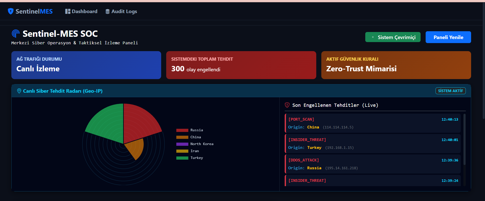
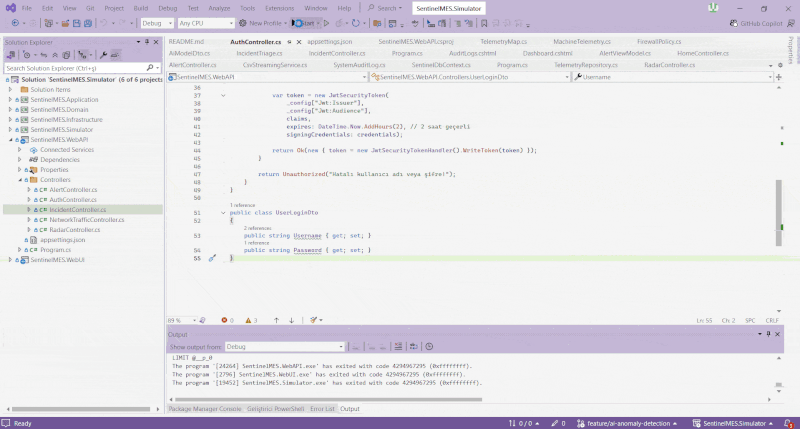
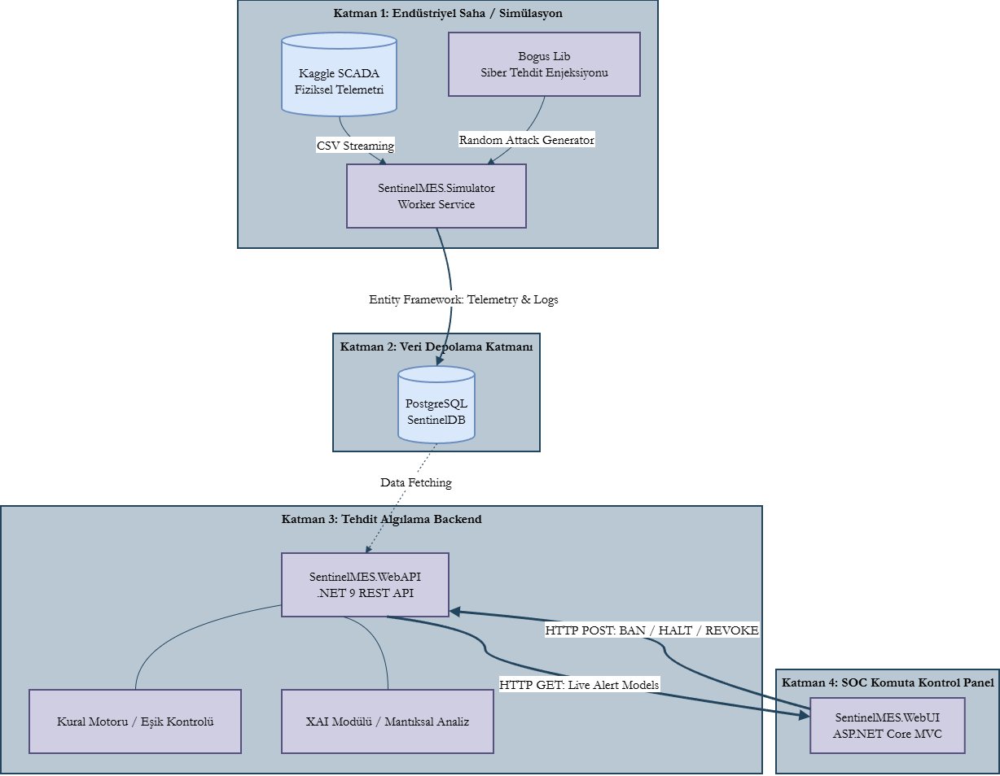
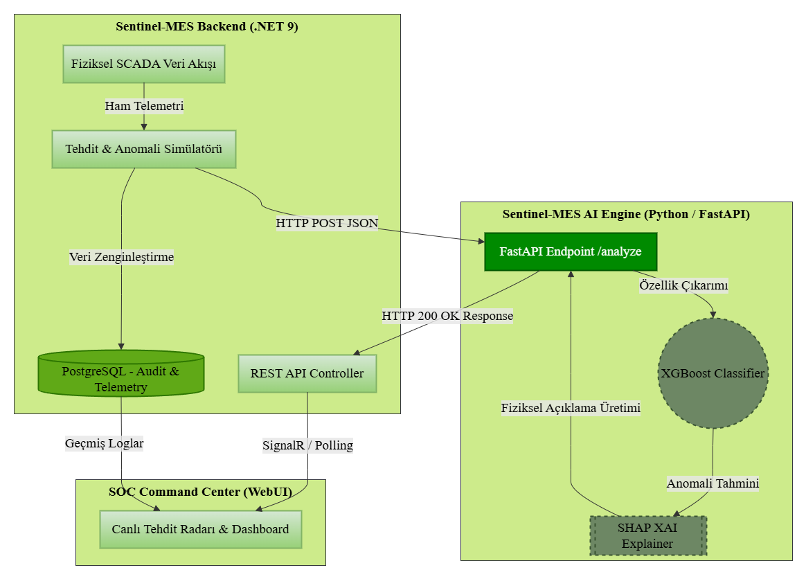
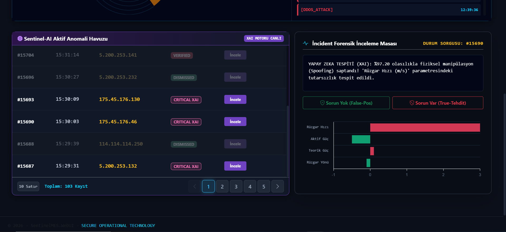
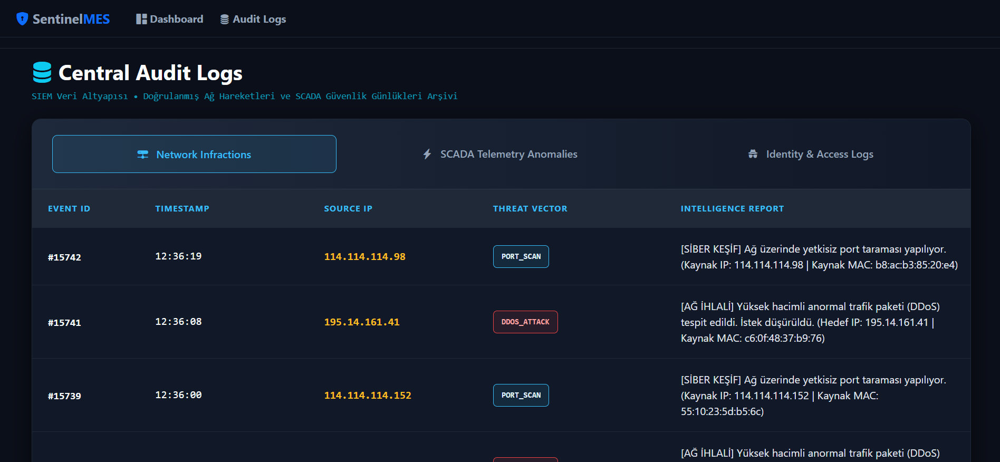
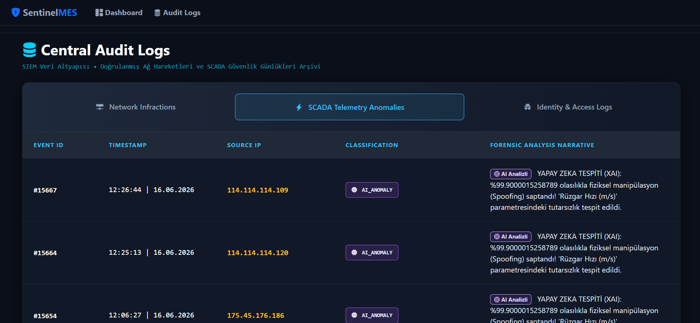
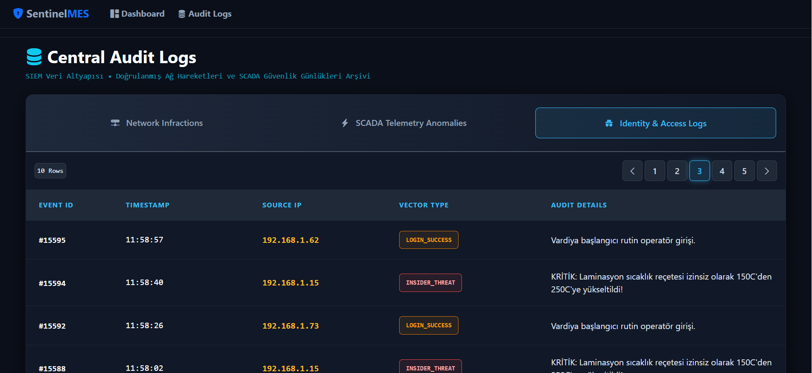

# Sentinel-MES: Industrial OT-SIEM & SOAR Platform

[🇹🇷 Türkçe](#turkce) | [🇺🇸 English](#english)

---

## 🇹🇷 Türkçe

**Sentinel-MES**, endüstriyel operasyonel teknoloji (OT) ortamları için özel olarak geliştirilmiş; **Purdue Modeli (ICS Referans Mimarisi)** hiyerarşisine tam uyumlu, hibrit bir **OT-SIEM** ve **SOAR** platformudur.

Kritik altyapıların (enerji santralleri, akıllı fabrikalar) dijital ikizlerini simüle ederek, fiziksel SCADA verileri ile siber tehditleri (DDoS, Spoofing, Insider Threat) eş zamanlı izler ve **Açıklanabilir Yapay Zeka (XAI)** ile forensik raporlar üretir. **Zero-Trust** prensibine dayalı olarak; ağdaki cihazların **IP/MAC eşleşmesini** anlık denetler ve ağ üzerindeki anomalileri forensik düzeyde analiz eder.

### Purdue Modeli ve Endüstriyel Hiyerarşi
Sentinel-MES, endüstriyel ağ güvenliğinin temelini oluşturan **Purdue Model (ICS Referans Mimarisi)** hiyerarşisine göre modüler tasarlanmıştır:

* **Level 0-2 (Process & Control Layer):** `SentinelMES.Simulator` katmanı; Kaggle SCADA verilerini ve sahte siber saldırı vektörlerini (Bogus) enjekte ederek gerçek bir operasyonel simülasyon ortamı simüle eder.
* **Level 3 (Site Operations Layer):** `SentinelMES.WebAPI` (Clean Architecture); üretim mantığını yönetir, kural motoru üzerinden ağ trafiğini filtreler ve "Zero-Trust" prensibini uygular.
* **Level 4-5 (Enterprise/SOC Layer):** `SentinelMES.WebUI`; XAI destekli forensik analiz, anlık tehdit radarı ve olay müdahale merkezi görevini görür.

> **Mimari Vizyon:** Sistem, API (Backend) ve UI (Frontend) olarak izole edilmiştir. Ayrıca veritabanı ile kullanıcı arayüzü sunucularının farklı ağlarda tutulması (Air-gap) siber saldırılara karşı maksimum izolasyon sağlar.

### Dataset ve Veri Kaynağı
Sentinel-MES, siber güvenlik ve operasyonel verilerin simülasyonu için iki ana veri kaynağından beslenmektedir:

1. **Siber Güvenlik Verisi (Network):** [UNB CIC-IDS-2017 Datasets](https://www.unb.ca/cic/datasets/index.html). Siber saldırı vektörlerini (DDoS, Port Scan vb.) simüle etmek için kullanılır.
2. **Fiziksel SCADA Verisi (Physical):** Kaggle üzerinde paylaşılan açık kaynaklı "Wind Turbine SCADA Data" seti. Fiziksel rüzgar türbini parametrelerini (rüzgar hızı, sıcaklık, aktif güç) simüle etmek için kullanılır.

> **Kurulum:** Datasetleri ilgili kaynaklardan temin ettikten sonra `.csv` dosyalarını `SentinelMES.Simulator/Scripts/` dizinine yerleştirmeniz yeterlidir. Sistem, bu veriyi `Worker Service` üzerinden işleyerek canlı bir operasyonel simülasyon akışına dönüştürür.

### Uçtan Uca Sistem Mimarisi (Clean Architecture)
Sentinel-MES, **Clean Architecture** prensiplerini temel alan **3 çekirdek katman** ile sistemin operasyonel işleyişini sağlayan **4 destekleyici modülün** entegrasyonuyla toplam **7 ana yapı** üzerinden çalışmaktadır:

#### A. Clean Architecture (Çekirdek Katmanlar)
1. **`SentinelMES.Domain` (Çekirdek):** Mimarinin en iç katmanıdır. `ActiveAlert` ve `SystemAuditLog` gibi sistemin ana varlıklarını (Entities) tutar. Hiçbir dış teknolojiye bağımlı değildir.
2. **`SentinelMES.Application` (İş Kuralları):** Sistemde "nelerin yapılacağını" (Örn: `IAlertRepository`, Use-Case handler'ları) tanımlar. Arayüzleri ve iş sözleşmelerini barındırır.
3. **`SentinelMES.Infrastructure` (Altyapı):** Veritabanı ve dış dünya ile asıl iletişimin kurulduğu yerdir. PostgreSQL bağlantıları, Entity Framework Core Migrations ve Repositories burada bulunur.

#### B. Operasyonel Servisler (Destekleyici Modüller)
4. **`SentinelMES.Simulator` (Canlı Simülasyon):** Kaggle verilerini ve Bogus siber saldırılarını arka planda sisteme enjekte eden "Worker Service" test motorudur.
5. **`SentinelMES.WebAPI` (Güvenlik Duvarı):** Dış dünyaya açılan yegane kapıdır. Tüm veriler bu RESTful API'nin kural motorundan (Detect) geçerek filtrelenir ve yetkisiz erişimler bloklanır.
6. **`SentinelMES.AI` (XAI Motoru):** Python/FastAPI tabanlı, `XGBoost` ve `SHAP` kütüphanelerini kullanarak karmaşık siber saldırıları ve anomali kök nedenlerini analiz eden yapay zeka servisidir.
7. **`SentinelMES.WebUI` (SOC Komuta Kontrol):** Güvenlik analistleri için karanlık tema (Dark Mode), olay müdahale butonları (Incident Response) ve XAI analiz arayüzleri sunan MVC tabanlı izleme panelidir.

> **Mimari Vizyon:** Sistem, **API (Backend)**, **AI Engine (Python)** ve **UI (Frontend)** olarak izole edilmiştir. Bu modüler yapı sayesinde her servis bağımsızca ölçeklendirilebilir. Veritabanı ile kullanıcı arayüzü sunucularının farklı ağlarda tutulması (**Air-gap**), siber saldırılara karşı maksimum izolasyon sağlar.

### Teknolojiler 

| Kategori | Teknolojiler |
| :--- | :--- |
| **Backend** | .NET 9.0 (Clean Architecture), WebAPI |
| **AI Engine** | Python (FastAPI), XGBoost, SHAP (XAI) |
| **Database** | PostgreSQL (Relational & Audit Storage) |
| **Frontend** | ASP.NET Core MVC (Razor), Bootstrap 5, Chart.js |
| **Dev/Simulation**| CsvHelper, Bogus (Threat Injection) |

### Proje Fazları ve Yol Haritası

* **Faz 1: Hibrit Simülasyon Motoru (Data Streaming):** `CsvHelper` ile gerçek rüzgar türbini verileri işlenir. `Bogus` kütüphanesi ile sistem, saniyede %16 oranında siber manipülasyon (DDoS, Port Scan, Spoofing) enjekte eder.
* **Faz 2: SQL ve Veritabanı (OT SOC Kuralları):** PostgreSQL; dinamik eşik tabloları (`SystemThresholds`) ve SQL Trigger'ları ile .NET'i beklemeden doğrudan veritabanı seviyesinde savunma hattı kurar.
* **Faz 3: .NET 9 Backend (Kural Motoru):** DDoS, Yatay Hareket (Lateral Movement) ve yetkisiz reçete değişikliklerini anlık tespit eden kural motoru.
* **Faz 4: Açıklanabilir Yapay Zekâ (XAI):** **XGBoost & SHAP** ile sistem sadece "Anomali var" demez; anomalinin hangi parametreden (Örn: "Spoofing: Güç verisi fiziksel olarak imkansız") kaynaklandığını açıklar.

* **Faz 5: SOC Paneli ve Olay Müdahale (Incident Response):** İnternete kapalı (Air-gapped) ağlarda çalışan; anlık tehdit radarı, Geo-IP takibi ve SOC analistlerinin tehditleri yönetebildiği merkezi izleme panelidir.

### SOC Komuta Kontrol Arayüzü

**1. Network Infractions (DDoS & Port Scan):**

**2. SCADA Telemetry Anomalies (Spoofing):**

**3. Identity & Access Logs (Insider Threat):**

---

## 🇺🇸 English

**Sentinel-MES** is a hybrid **OT-SIEM** and **SOAR** platform specifically developed for industrial operational technology (OT) environments, fully compliant with the **Purdue Model (ICS Reference Architecture)** hierarchy.

By simulating digital twins of critical infrastructures (power plants, smart factories), it simultaneously monitors physical SCADA data and cyber threats (DDoS, Spoofing, Insider Threat), producing forensic reports with **Explainable AI (XAI)**. Based on the **Zero-Trust** principle, it instantly audits the **IP/MAC pairings** of devices on the network and analyzes network anomalies at a forensic level.

### Purdue Model and Industrial Hierarchy
Sentinel-MES is modularly designed according to the **Purdue Model (ICS Reference Architecture)** hierarchy, which forms the foundation of industrial network security:

* **Level 0-2 (Process & Control Layer):** The `SentinelMES.Simulator` layer injects Kaggle SCADA data and fake cyber attack vectors (Bogus) to simulate a real operational environment.
* **Level 3 (Site Operations Layer):** `SentinelMES.WebAPI` (Clean Architecture) manages production logic, filters network traffic via the rule engine, and applies the "Zero-Trust" principle.
* **Level 4-5 (Enterprise/SOC Layer):** `SentinelMES.WebUI` serves as the XAI-supported forensic analysis, real-time threat radar, and incident response center.

> **Architectural Vision:** The system is isolated as API (Backend) and UI (Frontend). Furthermore, keeping the database and user interface servers on different networks (Air-gap) provides maximum isolation against cyber attacks.

### Dataset and Data Source
Sentinel-MES is fed by two main data sources for the simulation of cybersecurity and operational data:

1. **Cybersecurity Data (Network):** [UNB CIC-IDS-2017 Datasets](https://www.unb.ca/cic/datasets/index.html). Used to simulate cyber attack vectors (DDoS, Port Scan, etc.).
2. **Physical SCADA Data (Physical):** Open-source "Wind Turbine SCADA Data" set shared on Kaggle. Used to simulate physical wind turbine parameters (wind speed, temperature, active power).

> **Installation:** After obtaining the datasets from the respective sources, simply place the `.csv` files into the `SentinelMES.Simulator/Scripts/` directory. The system processes this data via the `Worker Service` and converts it into a live operational simulation stream.

### End-to-End System Architecture (Clean Architecture)
Sentinel-MES operates on a total of **7 main structures**, achieved by integrating **3 core layers** based on **Clean Architecture** principles with **4 supporting modules** that facilitate the operational workflow of the system:

#### A. Clean Architecture (Core Layers)
1. **`SentinelMES.Domain` (Core):** The innermost layer of the architecture. It holds the main entities of the system, such as `ActiveAlert` and `SystemAuditLog`. It has zero dependencies on external technologies.
2. **`SentinelMES.Application` (Business Rules):** Defines "what needs to be done" in the system (e.g., `IAlertRepository`, Use-Case handlers). Contains interfaces and business contracts.
3. **`SentinelMES.Infrastructure` (Infrastructure):** Where actual communication with the database and the outside world is established. Contains PostgreSQL connections, Entity Framework Core Migrations, and Repositories.

#### B. Operational Services (Supporting Modules)
4. **`SentinelMES.Simulator` (Live Simulation):** The "Worker Service" test engine that injects Kaggle data and Bogus cyber attacks into the system in the background.
5. **`SentinelMES.WebAPI` (Firewall):** The sole gateway to the outside world. All data is filtered through the rule engine (Detect) of this RESTful API, blocking unauthorized access.
6. **`SentinelMES.AI` (XAI Engine):** A Python/FastAPI-based artificial intelligence service that analyzes complex cyber attacks and anomaly root causes using `XGBoost` and `SHAP` libraries.
7. **`SentinelMES.WebUI` (SOC Command Control):** An MVC-based monitoring panel providing a Dark Mode, Incident Response buttons, and XAI analysis interfaces for security analysts.

> **Architectural Vision:** The system is isolated into **API (Backend)**, **AI Engine (Python)**, and **UI (Frontend)**. Thanks to this modular structure, each service can be scaled independently. Keeping the database and UI servers on different networks (**Air-gap**) provides maximum isolation against cyber attacks.

### Technologies

| Category | Technologies |
| :--- | :--- |
| **Backend** | .NET 9.0 (Clean Architecture), WebAPI |
| **AI Engine** | Python (FastAPI), XGBoost, SHAP (XAI) |
| **Database** | PostgreSQL (Relational & Audit Storage) |
| **Frontend** | ASP.NET Core MVC (Razor), Bootstrap 5, Chart.js |
| **Dev/Simulation**| CsvHelper, Bogus (Threat Injection) |

### Project Phases and Roadmap

* **Phase 1: Hybrid Simulation Engine (Data Streaming):** Real wind turbine data is processed with `CsvHelper`. The system injects cyber manipulations (DDoS, Port Scan, Spoofing) at a rate of 16% per second using the `Bogus` library.
* **Phase 2: SQL and Database (OT SOC Rules):** PostgreSQL establishes a defense line directly at the database level with dynamic threshold tables (`SystemThresholds`) and SQL Triggers, without waiting for .NET.
* **Phase 3: .NET 9 Backend (Rule Engine):** A rule engine that instantly detects DDoS, Lateral Movement, and unauthorized recipe modifications.
* **Phase 4: Explainable AI (XAI):** With **XGBoost & SHAP**, the system doesn't just say "There is an anomaly"; it explains which parameter caused the anomaly (e.g., "Spoofing: Power data is physically impossible").

* **Phase 5: SOC Panel and Incident Response:** A centralized monitoring panel operating on Air-gapped networks, where SOC analysts can manage threats alongside a real-time threat radar and Geo-IP tracking.

### SOC Command & Control Interface

**1. Network Infractions (DDoS & Port Scan):**

**2. SCADA Telemetry Anomalies (Spoofing):**

**3. Identity & Access Logs (Insider Threat):**

